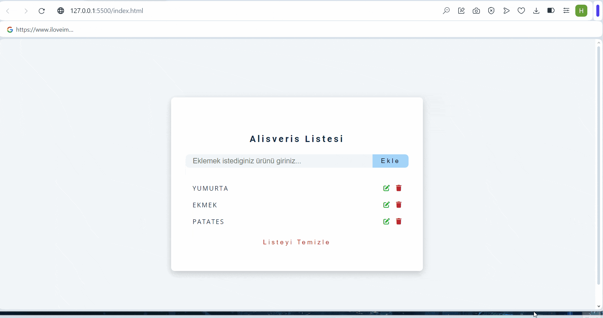

<h1>CRUD-APP-PROJECT</h1>

The purpose of a CRUD application is to provide a platform for a shopping list. Users can create (Create), read (Read), update (Update), and delete (Delete) their shopping lists on this platform. These four basic operations allow users to manage their shopping lists effectively. For example, a user can list the products needed for grocery shopping, edit the list, add or remove products from the list, or delete the completed shopping list. This makes the shopping process more organized and efficient.

<h2>Technologies used in the project</h2>

Codded in HTML5 , CSS3 and JS

<h2>Screen Gif</h2>

